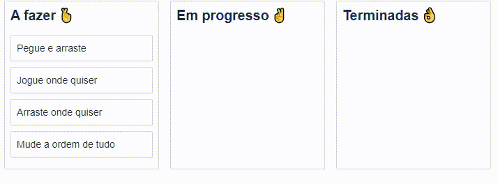

[](https://opensource.org/licenses/MIT)
[](https://choosealicense.com/licenses/mit)
[](https://github.com/renanlido/goRestaurant/commits)


<!--LOGO-->
<br/>
<div align="center">
    <h1> Drag and Drop </h1>
<br/><br/>
</div>

<!--THE RESULT-->

# <strong>O projeto!</strong>
<div>
  
<div>

<div>
    </br>
</div>

<!-- ABOUT THE PROJECT -->
## **Português**
<br/>

# <strong>Sobre o Projeto</strong>

Neste projeto, criei uma lista de tarefas.
Todas as tarefas podem ser movidas entre as tabelas apenas arrastando e soltando. 
</br></br>
Este projeto é baseado em React e a biblioteca utilizada foi a react-beautiful-dnd.

</br>

<!--INSTALATION-->

# **Instalação**

Para instalar e utilizar este projeto o processo é bem simples:
1. Após clonar o projeto utilize o comando:
    ```sh
    yarn
    ```
    para instalar as dependencaias. Caso não tenha o yarn instalado, utilize o gerenciador de pacotes da sua preferência.

2. Utilize o comando abaixo para rodar o aplicativo.
    ```ssh
    yarn start
    ```
<!-- LICENSE -->

# **Licença**

Distribuído sob a licença MIT. Veja `LICENSE` para mais informações.

<!-- CONTACT -->
</br>

# **Contato**

### Renan Oliveira - **renanlido@yahoo.com.br**

[Github](https://github.com/renanlido) - **https://github.com/renanlido** </br>
[Linkedin](https://www.linkedin.com/in/renanlido/) - **https://www.linkedin.com/in/renanlido/**

</br></br>
Obrigado por ter vindo 😊🤗
</br>
</br>
</br>
</br>

----------


## **English**
<br/>

<!--THE RESULT-->

# <strong>The project!</strong>
<div>
  
<div>

<div>
    </br>
</div>

# <strong>Aboult the project</strong>

In this project, i created a task list. All tasks can be moved between lists only dragging and dropping.
</br></br>
This project is based on React and in it we use the lib react-beautiful-dnd.

</br>

<!--INSTALATION-->

# **Instalation**

This instalation is very simple:
1. After clone the project, use the comand
    ```sh
    yarn
    ```
    for install all dependencies.

2. Use the bellow comand for run the aplication.
    ```ssh
    yarn start
    ```
<!-- LICENSE -->

# **License**

Distributed under license MIT. See `LICENSE` for more informations.

<!-- CONTACT -->
</br>

# **Contact**

### Renan Oliveira - **renanlido@yahoo.com.br**

[Github](https://github.com/renanlido) - **https://github.com/renanlido** </br>
[Linkedin](https://www.linkedin.com/in/renanlido/) - **https://www.linkedin.com/in/renanlido/**

</br></br>
Thank you for coming!! 😊🤗
